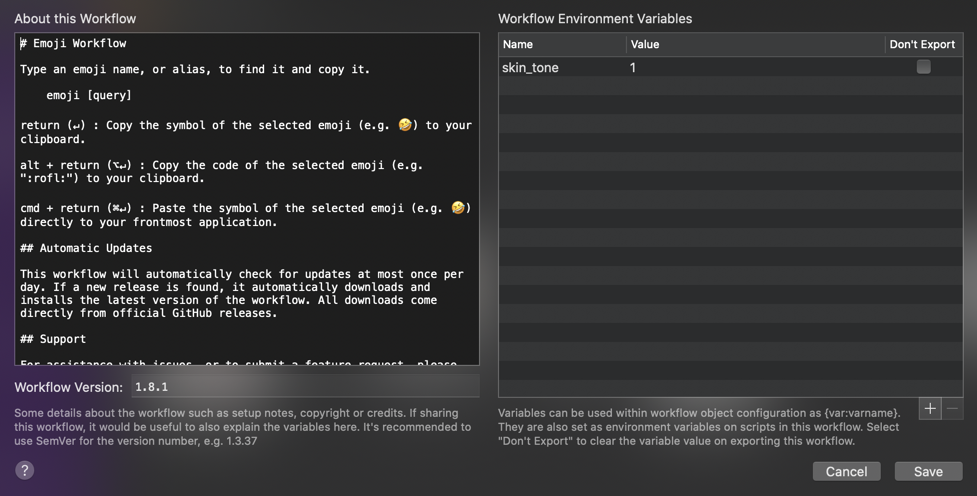

# alfred-emoji

[](https://travis-ci.org/jsumners/alfred-emoji)

An [Alfred workflow][alfred] that makes it easy to search for emoji and copy
them to the clipboard 🤘. **Now supports skin tones!**


## Installing the Workflow

[Download the provided Alfred workflow][releases].

Notice: This workflow relies on JXA (JavaScript for Automation) that is built
into macOS.

## Usage

```
emoji [query]
```

Press <kbd>return</kbd> (↵): **Copy the symbol** of the selected emoji (e.g. 🤣) to
your clipboard.

Press <kbd>alt</kbd>+<kbd>return</kbd> (⌥↵): **Copy the code** of the selected emoji)
(e.g. `:rofl:`) to your clipboard.

Press <kbd>shift</kbd>+<kbd>return</kbd> (⇧↵): **Copy the default symbol** of the selected emoji)
(e.g. 🤣) to your clipboard with no skin tone modifier.

Press <kbd>cmd</kbd>+<kbd>return</kbd> (⌘↵): **Paste the symbol** of the selected
emoji (e.g. 🤣) directly to your frontmost application.

### Set skin tone

To change the emoji skin tone for supported emoji you can change the `skin_tone` variable in Alfred.



Options:
- No value => 👍
- `0` => 👍🏻
- `1` => 👍🏼
- `2` => 👍🏽
- `3` => 👍🏾
- `4` => 👍🏿

After setting skin tone you can still quickly copy the default emoji with the <kbd>shift</kbd> modifier.

## Automatic Updates

This workflow will automatically check for updates at most once per day. If a
new release is found, it automatically downloads and installs the latest
version of the workflow. All downloads come directly from official [GitHub
releases][releases].

## Optional Hotkey and Snippet Triggers

Trigger the workflow with either a custom hotkey or a custom snippet.

## Building the Workflow

1. Clone this repository
2. `npm install`
3. `npm run build`

## Loading the Workflow into Alfred

1. `npm run load`

## Inspiration

This is based on the original work by [Carlos Galdino][carlos]. His project
seems to be unmaintained (some emoji don't copy and some newer are missing).
Whereas his project is based on the Ruby language, this one is based on
JavaScript.

## Other

* [Associated Alfred Forum Post][alfredforum]
* [Emoji Keyword Library][emojilib]

## License

[MIT License](http://jsumners.mit-license.org/)

[alfred]: https://alfredapp.com/
[carlos]: https://github.com/carlosgaldino/alfred-emoji-workflow/
[releases]: https://github.com/jsumners/alfred-emoji/releases
[alfredforum]: https://www.alfredforum.com/topic/11126-alfred-emoji-search-emojis-by-name-or-keyword/
[emojilib]: https://github.com/muan/emojilib
