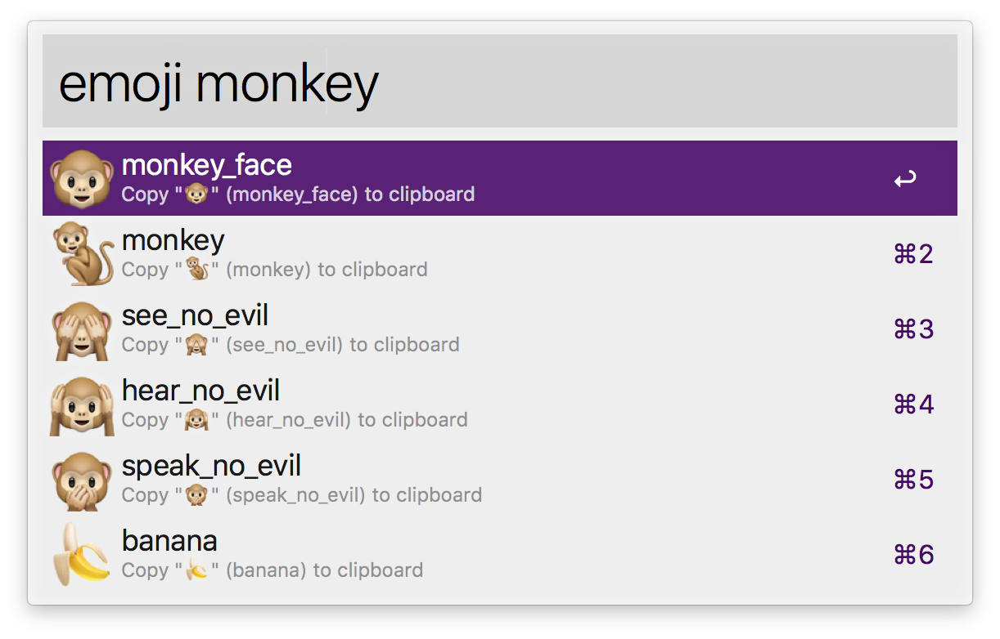

# alfred-emoji

[](https://travis-ci.org/jsumners/alfred-emoji)

An [Alfred workflow][alfred] that makes it easy to search for emoji and copy
them to the clipboard 🤘.



## Installing the Workflow

[Download the provided Alfred workflow][releases].

Notice: Alfred does not bundle the Node runtime, and neither does macOS.
Therefore, the workflow generated by this project downloads the latest LTS
release of Node and embeds it. You are welcome to build your own copy of this
workflow instead of trusting the [provided binary][releases].

## Usage

```
emoji [query]
```

Press <kbd>return</kbd> (↵): **Copy the symbol** of the selected emoji (e.g. 🤣) to
your clipboard.

Press <kbd>alt</kbd>+<kbd>return</kbd> (⌥↵): **Copy the code** of the selected emoji)
(e.g. `:rofl:`) to your clipboard.

Press <kbd>cmd</kbd>+<kbd>return</kbd> (⌘↵): **Paste the symbol** of the selected
emoji (e.g. 🤣) directly to your frontmost application.

## Automatic Updates

This workflow will automatically check for updates at most once per day. If a
new release is found, it automatically downloads and installs the latest
version of the workflow. All downloads come directly from official [GitHub
releases][releases].

## Building the Workflow

1. Clone this repository
2. `npm install`
3. `npm run build`

## Loading the Workflow into Alfred

1. `npm run load`

## Inspiration

This is based on the original work by [Carlos Galdino][carlos]. His project
seems to be unmaintained (some emoji don't copy and some newer are missing).
Whereas his project is based on the Ruby language, this one is based on
JavaScript using [Node.js][node].

## License

[MIT License](http://jsumners.mit-license.org/)

[alfred]: https://alfredapp.com/
[carlos]: https://github.com/carlosgaldino/alfred-emoji-workflow/
[node]: https://nodejs.org/
[releases]: https://github.com/jsumners/alfred-emoji/releases
